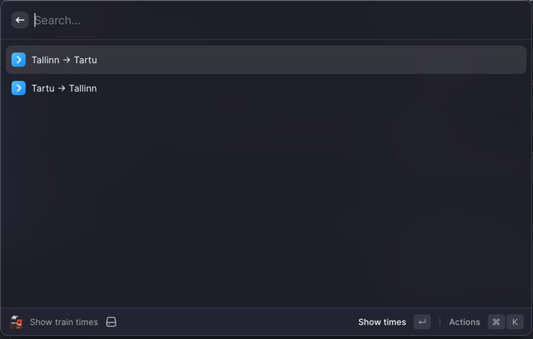
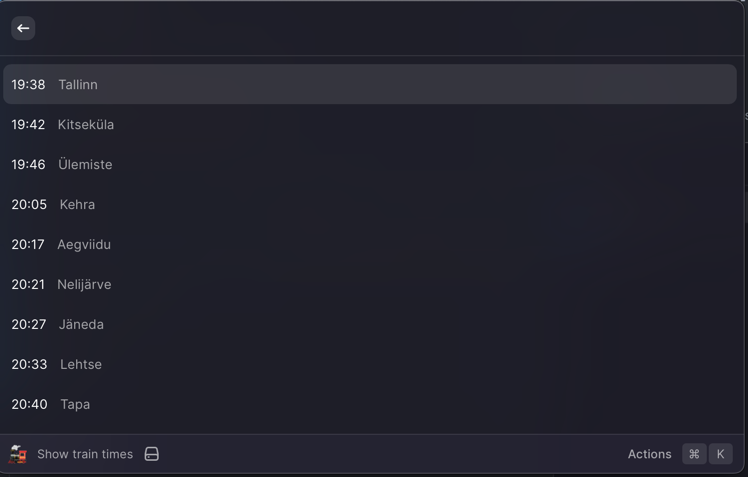

# Tallinn-Tartu train times in Raycast

See the [Elron](https://elron.ee) train times for
- Tallinn -> Tartu
- Tartu -> Tallinn
- More cities coming soon (PRs welcome)





## Usage
Haven't bothered to publish this to the Raycast store yet, so clone this to your Raycast extensions folder and run it locally for now.

[See Raycast's documentation for more](https://developers.raycast.com/basics/getting-started)

### Local development
```bash
npm install
npm run dev
```